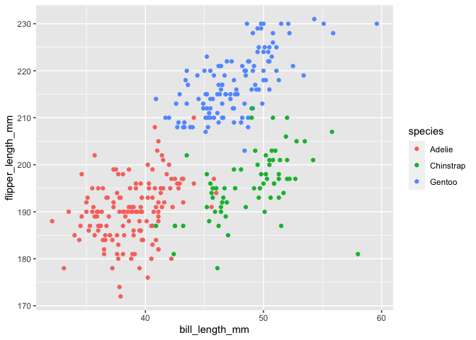

P8105 HW1
================
Hansheng Zhang
2021-09-28

# Problem 1

A random sample of size 10 from a standard Normal distribution

``` r
library(tidyverse)
```

    ## ── Attaching packages ─────────────────────────────────────── tidyverse 1.3.1 ──

    ## ✓ ggplot2 3.3.5     ✓ purrr   0.3.4
    ## ✓ tibble  3.1.4     ✓ dplyr   1.0.7
    ## ✓ tidyr   1.1.3     ✓ stringr 1.4.0
    ## ✓ readr   2.0.1     ✓ forcats 0.5.1

    ## ── Conflicts ────────────────────────────────────────── tidyverse_conflicts() ──
    ## x dplyr::filter() masks stats::filter()
    ## x dplyr::lag()    masks stats::lag()

``` r
hw1_df = tibble(
  samp = rnorm(10),
  vec_logical = ifelse(samp > 0, TRUE, FALSE),
  vec_char = rep(c("New York", "Chicago", "Los Angeles"), length.out = 10),
  vec_factor = factor(rep(c("East Coast", "Midwest", "West Coast"), length.out = 10))
)

hw1_df
```

    ## # A tibble: 10 × 4
    ##       samp vec_logical vec_char    vec_factor
    ##      <dbl> <lgl>       <chr>       <fct>     
    ##  1  0.226  TRUE        New York    East Coast
    ##  2 -0.580  FALSE       Chicago     Midwest   
    ##  3 -0.132  FALSE       Los Angeles West Coast
    ##  4  0.680  TRUE        New York    East Coast
    ##  5  0.321  TRUE        Chicago     Midwest   
    ##  6 -1.12   FALSE       Los Angeles West Coast
    ##  7  1.62   TRUE        New York    East Coast
    ##  8 -1.31   FALSE       Chicago     Midwest   
    ##  9 -0.0665 FALSE       Los Angeles West Coast
    ## 10 -0.570  FALSE       New York    East Coast

``` r
mean(hw1_df$samp)
```

    ## [1] -0.09266227

``` r
mean(hw1_df$vec_logical)
```

    ## [1] 0.4

``` r
mean(hw1_df$vec_char)
```

    ## Warning in mean.default(hw1_df$vec_char): argument is not numeric or logical:
    ## returning NA

    ## [1] NA

``` r
mean(hw1_df$vec_factor)
```

    ## Warning in mean.default(hw1_df$vec_factor): argument is not numeric or logical:
    ## returning NA

    ## [1] NA

It appears we can take the mean of the random numbers and the logical
vector but not the character vector or the factor vector.

``` r
as.numeric(hw1_df$samp)
as.numeric(hw1_df$vec_logical)
as.numeric(hw1_df$vec_char)
as.numeric(hw1_df$vec_factor)
```

The random numbers and logical vector are actually numbers. The
character vector appears as NA since it is a string, and factor vector
translates to levels, but not numbers. Therefore, the mean can only be
taken for the first two.

# Problem 2

## Palmer Penguins

``` r
data("penguins", package = "palmerpenguins")

rows = nrow(penguins)
cols = ncol(penguins)
total = rows*cols

penguin_variables = names(penguins)

mean_flipper = penguins %>% drop_na() %>% summarise(mean(flipper_length_mm)) %>% round(digits = 2)
```

There are **344** rows and **8** columns in this data set for a total of
**2752** values.

The variables in this data set are **species, island, bill\_length\_mm,
bill\_depth\_mm, flipper\_length\_mm, body\_mass\_g, sex, year**

The mean flipper length is **200.97** mm.

``` r
scatter = penguins %>% drop_na() %>% 
ggplot((aes(bill_length_mm, flipper_length_mm, color = species))) + geom_point()

ggsave("hw1_scatterplot.pdf", plot = scatter)
```

    ## Saving 7 x 5 in image

``` r
scatter
```

<!-- -->
