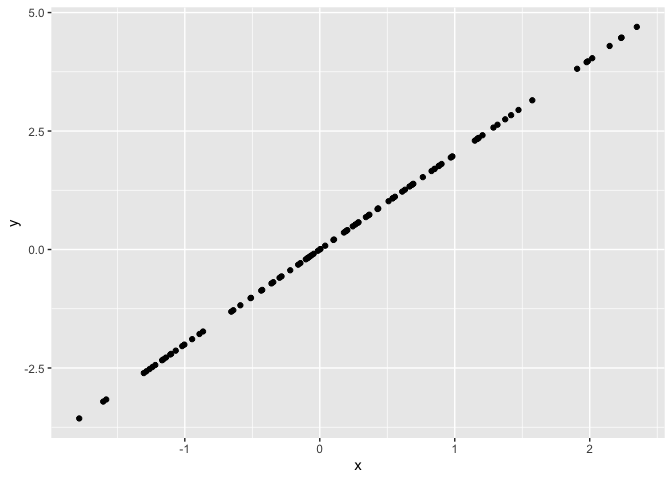

P8105 HW1
================
Hansheng Zhang
2021-09-28

# Problem 1

A random sample of size 10 from a standard Normal distribution

``` r
library(tidyverse)
```

    ## ── Attaching packages ─────────────────────────────────────── tidyverse 1.3.1 ──

    ## ✓ ggplot2 3.3.5     ✓ purrr   0.3.4
    ## ✓ tibble  3.1.4     ✓ dplyr   1.0.7
    ## ✓ tidyr   1.1.3     ✓ stringr 1.4.0
    ## ✓ readr   2.0.1     ✓ forcats 0.5.1

    ## ── Conflicts ────────────────────────────────────────── tidyverse_conflicts() ──
    ## x dplyr::filter() masks stats::filter()
    ## x dplyr::lag()    masks stats::lag()

``` r
hw1_df = tibble(
  samp = rnorm(10),
  vec_logical = ifelse(samp > 0, TRUE, FALSE),
  vec_char = rep(c("New York", "Chicago", "Los Angeles"), length.out = 10),
  vec_factor = factor(rep(c("East Coast", "Midwest", "West Coast"), length.out = 10))
)

hw1_df
```

    ## # A tibble: 10 × 4
    ##       samp vec_logical vec_char    vec_factor
    ##      <dbl> <lgl>       <chr>       <fct>     
    ##  1 -0.796  FALSE       New York    East Coast
    ##  2 -0.112  FALSE       Chicago     Midwest   
    ##  3  0.551  TRUE        Los Angeles West Coast
    ##  4  0.964  TRUE        New York    East Coast
    ##  5 -0.0243 FALSE       Chicago     Midwest   
    ##  6 -0.368  FALSE       Los Angeles West Coast
    ##  7 -0.492  FALSE       New York    East Coast
    ##  8 -0.674  FALSE       Chicago     Midwest   
    ##  9  1.65   TRUE        Los Angeles West Coast
    ## 10 -0.0235 FALSE       New York    East Coast

``` r
mean(hw1_df$samp)
```

    ## [1] 0.06709099

``` r
mean(hw1_df$vec_logical)
```

    ## [1] 0.3

``` r
mean(hw1_df$vec_char)
```

    ## Warning in mean.default(hw1_df$vec_char): argument is not numeric or logical:
    ## returning NA

    ## [1] NA

``` r
mean(hw1_df$vec_factor)
```

    ## Warning in mean.default(hw1_df$vec_factor): argument is not numeric or logical:
    ## returning NA

    ## [1] NA

It appears we can take the mean of the random numbers and the logical
vector but not the character vector or the factor vector.

# Problem 2

Plot

``` r
plot_df = tibble(
  x = rnorm(100),
  y = 2*x
)

ggplot(plot_df, aes(x = x, y = y)) + geom_point()
```

<!-- -->
